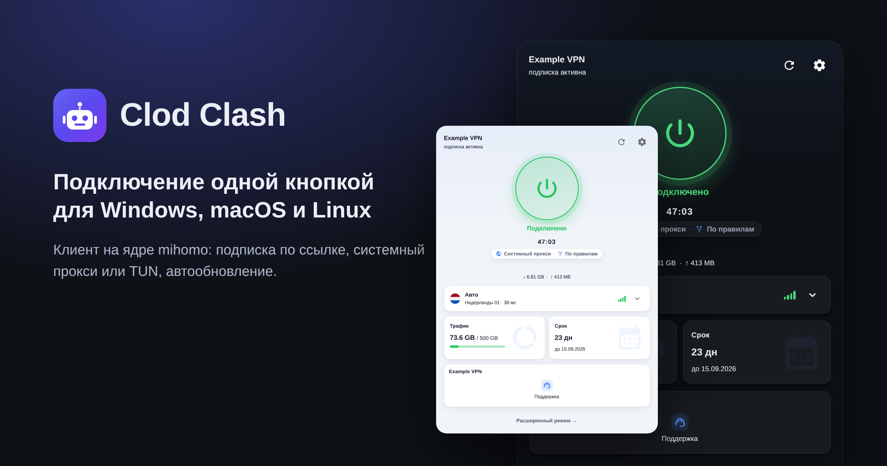
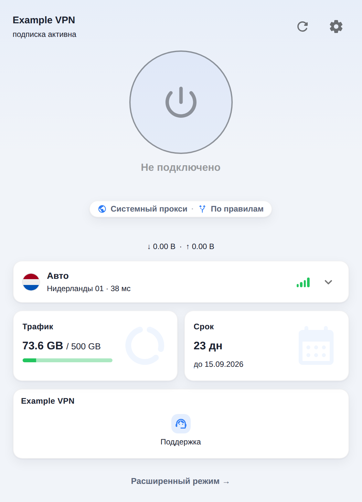
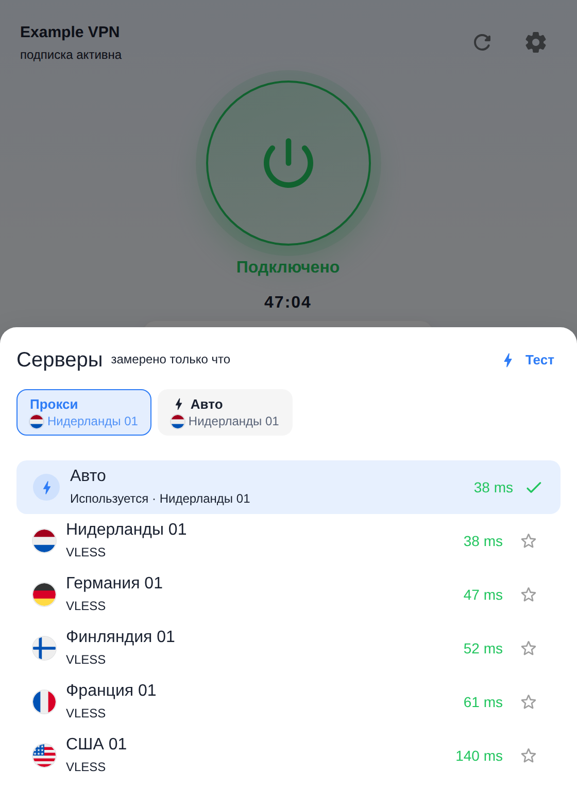
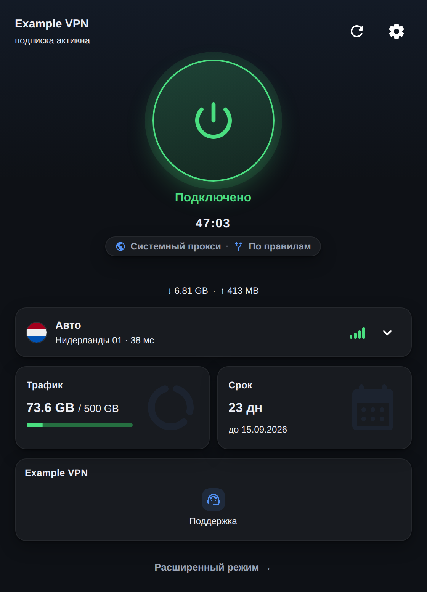
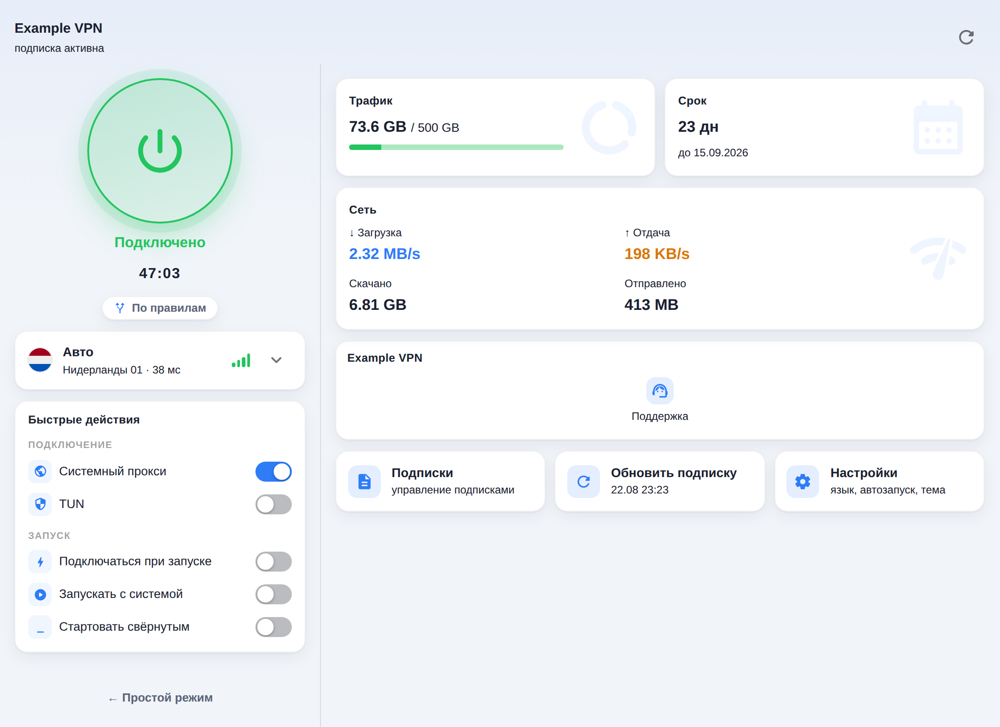

<h1 align="center">
  Clod Clash
</h1>

  Десктопный клиент для подписок Remnawave на ядре
  <a href="https://github.com/MetaCubeX/mihomo">Mihomo</a>.
   
  Форк <a href="https://github.com/clash-verge-rev/clash-verge-rev">Clash Verge Rev</a>.

  Languages: <b>Русский</b> · <a href="./docs/README_en.md">English</a>
  ·
  <a href="https://mrvibecodic.github.io/clod-clash/">Документация</a>
  ·
  <a href="https://mrvibecodic.github.io/clod-clash/download">Скачать</a>

  

---

## Что это

Clod Clash — сборка Clash Verge Rev, доведённая до состояния «клиент для клиентов панели»:
пользователь вставляет ссылку на подписку и нажимает одну кнопку. Всё, что панель хочет
сообщить клиенту — название тарифа, логотип, объявление, ссылку на кабинет и поддержку,
лимит устройств, смену адреса подписки — приложение понимает и показывает.

Ядро Mihomo не модифицируется: используется официальный бинарник и штатный REST/IPC.
Вся техническая часть Clash Verge Rev (правила, соединения, логи, редакторы конфигов)
сохранена — она просто убирается с глаз в расширенный режим.

> Подробная документация для пользователей и провайдеров —
> **[mrvibecodic.github.io/clod-clash](https://mrvibecodic.github.io/clod-clash/)**.
> Настройка панели — в [docs/REMNAWAVE.md](./docs/REMNAWAVE.md).

  
  
  

  

## Преимущества Clod Clash

* **34 заголовка ответа панели** (Remnawave и Happ) плюс синонимы для совместимости с другими
  клиентами, и шесть своих в запросе — название тарифа, логотип, объявление, промо-баннер,
  личный кабинет, поддержка, текст для диалога лимита устройств. Полный список —
  в [docs/HEADERS.md](./docs/HEADERS.md).
* **Идентификация устройства** (`x-hwid`) с понятной обработкой лимита устройств.
* **Резервный адрес подписки** (`fallback-url`, `fallback-domain`) и **смена адреса провайдером**
  (`new-url`, `new-domain`) — новый адрес принимается только после успешной пробной загрузки.
* **Подписка загружается через туннель**, когда прямой путь не работает: сначала напрямую, потом
  через собственное ядро, потом через системный прокси — и при импорте, и при обновлении.
* **Добавление подписки одним полем**: ссылка, остальное свёрнуто; после добавления видно, что
  по ней нашлось. Подписки можно раскладывать по группам.
* **Состояние подписки видно с одного взгляда**: активная залита акцентом, истекающая жёлтая,
  истёкшая приглушена и подчёркнута красным, исчерпанный трафик — отдельное состояние.
* **Пустой ответ панели объясняется словами.** Remnawave, когда выдавать нечего, отвечает не
  ошибкой, а конфигом из узлов-обманок `0.0.0.0`. Клиент узнаёт их структурно, а не по названию,
  и показывает причину: «Подписка истекла», «Трафик закончился» или «Провайдер не выдал серверы»,
  цитируя при этом слова самой панели. Провайдер может забрать объяснение себе заголовком
  `clod-show-0hosts` — тогда его узлы показываются как есть.
* **Безлимитный трафик и бессрочная подписка** показываются словами, а не «0 B» и прочерком.
* **Срок считается по часам панели**, а не только по часам устройства: разницу клиент снимает
  из обычного заголовка `Date` при каждом обновлении подписки, поэтому на компьютере с
  неверным временем срок и напоминания не врут, и работает это офлайн. Последние сутки
  показываются в часах.
* **Расход трафика между обновлениями подписки** досчитывается на месте и помечается как
  примерный; частота опроса ядра идёт от интервала обновления подписки.
* **Режим TUN настраивается сам**: на Windows службу ставит установщик приложения (отдельного
  запроса прав нет ни при установке, ни при обновлении), выбор пользователя не стирается, а провал
  старта виден на экране, а не только в логе.
* **Простой режим интерфейса** — одна кнопка Connect; вся техническая часть Clash Verge Rev
  остаётся в расширенном. Настройки в нём тоже короткие: подключение, автозапуск, язык, тема,
  идентификация устройства, отчёт для поддержки и версия. Остальное не отобрано, а убрано
  под «Продвинутые настройки» — раскрывающийся блок с четырьмя группами, где лежат ядро, сеть,
  оформление, диагностика и входы на технические экраны.
* **Предварительные сборки — по выбору.** В «Продвинутых настройках» есть тумблер: принимать
  ли альфа- и бета-версии. Пока проект в альфе он включён (иначе обновлений не было бы вовсе),
  но выключается одним щелчком — тогда клиент будет ждать первого стабильного релиза.
* **Быстрые действия на главной**: системный прокси, TUN, автозапуск и старт свёрнутым без захода
  в настройки.
* **Выбор сервера не сбрасывается** тестом задержек и обновлением подписки; избранные всплывают
  наверх и подменяют пропавший узел.
* **Описание сервера словами провайдера** — панель кладёт его в подписку (поле Server description
  у хоста), клиент показывает подписью под именем вместо бесполезного типа узла. Что включить на
  стороне панели — в [docs/REMNAWAVE.md](docs/REMNAWAVE.md).
* **Обновление ядра Mihomo отдельно от приложения** — управляемое ядро в настройках.

---

## Режим TUN

TUN перехватывает трафик всех приложений, включая те, что не умеют ходить через системный
прокси. Для него нужен привилегированный помощник — фоновая служба; в Clash Verge Rev её
ставят руками из настроек, и до тех пор переключатель TUN недоступен.

Здесь это сделано так, чтобы пользователь трогал только сам переключатель:

* **На Windows службу ставит установщик приложения.** Он и так запускается с правами
  администратора, поэтому отдельного запроса не будет ни при установке, ни при обновлении:
  обновление подменяет бинарь службы вместе с приложением и запускает её снова, так что
  версии не расходятся. С правами поднимается **только служба**: само приложение и его
  WebView остаются непривилегированными.
* **Если службы всё-таки нет, приложение доводит дело само** — но не вслепую. Сначала оно
  спрашивает систему, что та знает о службе, и делает минимальное: зарегистрирована и
  запускается — просто ждёт (при автозапуске служба поднимается позже приложения);
  остановлена — запускает; отвечает, но устарела — чинит; нет вовсе — ставит. Один запрос
  прав (UAC на Windows, пароль администратора на macOS, `pkexec` на Linux).
* **Служба нужна ради TUN — значит, при выключенном TUN её не трогают вовсе.** Ни проверок с
  правами, ни установки: выключенный переключатель не повод показывать системное окно.
* **Отказ уважается, и попытка не повторяется по кругу.** Если запрос прав отклонён или
  служба после установки так и не отвечает, приложение работает дальше через системный прокси
  и само больше не спрашивает — до следующего обновления версии. Проверяется при этом факт, а
  не слово установщика: на Windows он возвращает «готово» и тогда, когда служба уже была
  зарегистрирована. Переключатель TUN остаётся рабочим: включение = «поставь службу и включи»,
  это уже просьба пользователя.
* **Выбор пользователя не стирается.** Раньше приложение при старте писало
  `enable_tun_mode: false` прямо в конфиг, если служба не успела ответить — а при
  автозапуске она отвечает позже приложения. Теперь недоступность действует только на
  текущую сессию, файл настроек не трогается.
* **Ядро не ждут молча.** Если служба поднимается медленнее приложения, ядро стартует без
  неё и переезжает на службу, как только та ответит, — без разрыва соединений. Это работает
  на всех трёх системах.
* **Факт вместо обещания.** Вывод ядра разбирается: если mihomo не смог поднять устройство
  (`Start TUN listening error: … operation not permitted`), TUN честно гаснет, а не остаётся
  зелёным при мёртвом туннеле. Значок и галочка в трее показывают то же, что главный экран, —
  состояние туннеля, а не сохранённую настройку.
* **Ядро под присмотром в обоих режимах.** Упавшее ядро перезапускается — до трёх попыток
  подряд, — и это работает не только для встроенного процесса, но и когда ядро запущено
  системной службой: там его завершение никому не видно, поэтому приложение раз в полминуты
  спрашивает у ядра версию и считает отказом два молчания подряд. После перезапуска экран
  обновляется сам, а не показывает серверы и задержки от прежнего процесса.
* **Проверка состояния ничего не чинит.** Она больше не умеет устанавливать: если служба на
  диске старая, приложение говорит об этом один раз и предлагает починить в настройках. Чинит либо
  кнопка, либо описанный выше разовый заход при включённом TUN. Раньше проверку дёргал каждый старт
  ядра — а на Windows старт повторяется до пяти раз, — и запрос прав всплывал по десятку раз подряд.
* **Секция `tun` принадлежит приложению.** Профиль от провайдера (или ручной merge/script) больше
  не может ни выключить TUN, ни включить его: перед ручными правками снимается снимок, после —
  восстанавливается, а ключа, которого не было, не появится.
* **Три ключа туннеля всё же отданы наружу.** `stack`, `strict-route` и `dns-hijack` собираются
  лесенкой «выбор пользователя → шаблон подписки → умолчание клиента» (`gvisor`, `false`,
  `any:53`), поэтому провайдер может править их шаблоном, без новой версии клиента. В диалоге
  «Настройки TUN» положение **Auto** и означает «слушаться подписки». Что при этом легко сломать —
  в [docs/REMNAWAVE.md](./docs/REMNAWAVE.md#4-граница-ответственности-что-ваше-что-клиента);
  главное: на Windows с включённым брандмауэром стеки `system` и `mixed` не работают вовсе, пока
  ядро не разрешено вручную, поэтому на Windows клиент берёт из шаблона только `gvisor`, а
  `system` и `mixed` там включаются лишь явным выбором пользователя в диалоге TUN.
* **Ядро запускается только то, которое мы уже видели.** Служба поднимает бинарь по пути,
  который называет приложение, и делает это с правами системы — то есть подменённый файл ядра
  получил бы SYSTEM. Отпечаток файла запоминается при первой встрече (для скачанного ядра — прямо
  при установке, по уже проверенным байтам) и сверяется перед каждым запуском: не совпал — ядро не
  стартует, а на экране появляется объяснение. Обновление приложения законно приносит другой бинарь,
  поэтому после него отпечатки снимаются заново.
* **Системный DNS возвращается даже после падения.** На macOS при TUN подменяется системный DNS;
  теперь исходное значение и имя сетевого сервиса пишутся в файл рядом с конфигами, и если прошлый
  запуск не успел вернуть DNS (упали, убили, выключили питание), он возвращается при следующем
  старте. Заодно подмена перестала повторяться на каждую генерацию конфига.
* **Это видно на экране, а не только в уведомлении.** Пока ставится служба, под
  переключателями (в простом режиме — под кнопкой Connect) висит строка «Настраиваем TUN —
  подтвердите запрос системы»: она видна за системным окном и объясняет, кто его показал.
  Если TUN не поднялся, там же остаётся «TUN не запустился, трафик идёт мимо туннеля» с
  кнопкой «Настроить» — тост исчезает, строка нет.

---

## Экран подписок

**Подписка тянется через туннель, если домен недоступен.** Каждая загрузка подписки — и импорт, и
обновление — идёт лесенкой: сначала напрямую, потом через собственное ядро, потом через системный
прокси. Когда домен провайдера заблокирован, живой канал до него — уже поднятый туннель на прошлых
узлах. Ответ «устройство не опознано» через прокси не повторяется: адрес доступен, отвечает сервис.

**Добавление — одно поле.** По кнопке «Добавить подписку» открывается окно, где видна только
ссылка от сервиса: название, срок, трафик и серверы приходят вместе с ней. Имя, группа, интервал
обновления, User-Agent, таймаут и тумблеры живут в свёрнутом блоке «Дополнительно» — при правке
существующей подписки он раскрыт сразу, потому что заходят туда именно за ними. Второй шаг
показывает, что нашлось по ссылке, чтобы было видно, ту ли подписку добавили. Ошибка остаётся в
окне рядом с полем, а не улетает уведомлением в угол, и введённое не теряется.

**Состояние видно с одного взгляда.** Активная подписка залита акцентом и подписана «Активна»,
истекающая (≤ 3 дней или ≥ 90% трафика) — жёлтым, истёкшая приглушена и подчёркнута красной
полосой, а исчерпанный трафик при живом сроке — отдельное состояние «Трафик кончился». Активную
подписку приложение не приглушает никогда: даже истёкшая, она остаётся читаемой, потому что именно
на ней человек сейчас сидит.

**Группы.** Подписке можно поставить ярлык группы (в её свойствах, там же создаётся новая), и над
сеткой появляется ряд фильтров с числом карточек в каждой группе. Группа — только про внешний вид:
ядро о ней не знает. Пустая группа исчезает сама, а если групп нет ни одной, ряда фильтров тоже нет.

---

## Заголовки подписки

Полный список того, что клиент отправляет панели и что понимает в её ответе, — в
[docs/HEADERS.md](./docs/HEADERS.md). Там же правила разбора, подсветка слов цветом в объявлениях
и фильтр узлов-заглушек.

---

## Настройка панели Remnawave

Полный гайд — **[docs/REMNAWAVE.md](./docs/REMNAWAVE.md)**: правило User-Agent,
модификация шаблона ответа MIHOMO (правила маршрутизации, группы, маркер
`# LEAVE THIS LINE!`, ключи `remnawave:`), какие ключи шаблона клиент
перезаписывает, и настройка заголовков. Коротко:

**Правило User-Agent.** Стандартные правила формата ответа (subscription response rules)
в Remnawave не знают про наш клиент. Добавьте правило с регулярным выражением
`^clodclash` и форматом **MIHOMO**, иначе панель отдаст ответ по умолчанию, а приложение
покажет ошибку «панель не распознала клиент».

**Дополнительные заголовки.** `announce`, `announce-url`, `profile-logo`, `support-url`,
`new-url`, `fallback-url`, `notify-*`, наши `clod-*` (`clod-portal-url`, `clod-bot-url`,
`clod-monitor-url`, `clod-guide-url`, `clod-promo`,
`clod-promo-url`, `clod-hwid-limit`, `clod-simple-mode`, `clod-lock-mode`,
`clod-connect-mode`,
`clod-latency-style`, `clod-device-remove`)
и остальные, которых нет в стандартном наборе Remnawave, задаются через
`customResponseHeaders`. Значения с не-ASCII текстом надёжнее отдавать в виде
`base64:<payload>`; все ссылки — только `https://`.

**Лимит устройств.** При включённом лимите панель не отдаёт подписку без `x-hwid`.
Клиент шлёт его по умолчанию, а идентификатор стабилен между перезапусками и
обновлениями приложения — устройство не будет регистрироваться заново.

**Граница ответственности.** `mode`, порты, `external-controller` и большая часть
секции `tun` из шаблона перезаписываются настройками приложения;
`profile.store-selected` принудительно `true` — выбор сервера переживает обновления
подписки. Всё остальное — включая `dns`, `hosts`, `sniffer`, правила и группы — отдано
шаблону целиком, а `tun.stack`, `tun.strict-route` и `tun.dns-hijack` вы задаёте, пока
пользователь не выбрал их сам. Полный разбор, что чьё и на чём легче всего споткнуться
(стек TUN и брандмауэр Windows, `fake-ip-range`, исключения локальной сети), —
[docs/REMNAWAVE.md, раздел 4](./docs/REMNAWAVE.md#4-граница-ответственности-что-ваше-что-клиента).

---

## Отчёт для поддержки

Настройки → Расширенные → **«Отчёт для поддержки»**, и та же кнопка появляется под текстом
любой ошибки. В буфер обмена кладётся готовый текст:

* версия приложения, система, устройство, режим работы ядра;
* настройки, влияющие на подключение: ядро и его канал, TUN, что дёргает Connect,
  идентификация устройства, порт, уровень логов;
* состояние подписки: имя, трафик и срок из `subscription-userinfo`, состояние HWID, какие
  заголовки провайдер прислал, использовался ли запасной адрес;
* что фильтр заглушек выбросил в последний раз;
* хвосты лога приложения и лога ядра (по 800 строк, с учётом ротации).

**Строк ядра о соединениях в отчёте нет.** mihomo на своём обычном уровне пишет строку на
каждое соединение вместе с адресом назначения (`[TCP] … --> example.com:443 match …`), а на
подробном — ещё и каждый DNS-запрос. Сырой хвост такого лога — это история посещений, и
отдавать её в чат поддержки нельзя, поэтому такие строки в отчёт не попадают вовсе;
сколько их выброшено, написано в самом отчёте. Всё остальное — старт ядра, разбор конфига,
ошибки провайдеров — остаётся.

**Секреты в нём уже замаскированы.** От любого адреса — с любой схемой, не только `http`,
и включая `vless://`, `ss://` и ссылки внутри deep-link — остаётся только схема и хост:
путь, запрос и `user:pass@` уходят под `***`. Значение после `secret`, `token`, `password`,
`passwd`, `uuid`, `authorization`, `api-key`, `x-hwid`, `hwid`, `sub-url` заменяется на
`***` (список не исчерпывающий и будет пополняться) — в том числе когда ключ и значение
слиплись, как в JSON. То же с тем, что стоит после `Bearer`, `Basic` и `Token`. Отдельно
вырезается любое «слово» от 20 символов из алфавита `A–Z a–z 0–9 - _ = . + /`, если в нём
есть цифра или разный регистр, и любой hex от 16 знаков. Домашний каталог заменяется на
`~`, чтобы в отчёт не попало имя пользователя из пути. Это осознанно грубо: лучше замазать
лишнее, чем отдать в чат токен подписки.

Что в отчёте **остаётся намеренно**: домен провайдера (без него отчёт бесполезен), версии,
настройки подключения и состояние подписки в цифрах.

Отчёт полезен ровно настолько, насколько подробен лог, который в него попал, поэтому
на новых установках уровень логов приложения — `debug` (в уже настроенном приложении
остаётся тот, что стоял). Ротация ограничивает это 1 МБ на файл и восемью файлами;
уровень меняется в Настройки → Основные → «Расширенные настройки».

## Идентификатор устройства

Считается из машинного идентификатора операционной системы:

| Система | Источник |
| --- | --- |
| Windows | `HKLM\SOFTWARE\Microsoft\Cryptography\MachineGuid` |
| macOS | `IOPlatformUUID` |
| Linux | `/etc/machine-id`, при отсутствии — `/var/lib/dbus/machine-id` |

Значение солится и хешируется SHA-256, наружу уходят первые 32 hex-символа.
**Сам машинный идентификатор устройство не покидает**, имя компьютера (hostname)
не отправляется вовсе. Результат подходит под проверку
Remnawave 2.9 (`^[a-zA-Z0-9=-]{10,64}$`) и кэшируется в конфигурации приложения, чтобы
не измениться при обновлении. Если стабильный источник недоступен, генерируется
случайный идентификатор и тоже кэшируется.

Идентификатор отправляется **только** на адрес подписки — больше никуда.
Выключается переключателем **«Идентификация устройства»** в настройках, в разделе
«Основные». В подсказке рядом с ним видно ровно те значения, которые уходят в панель:
`x-hwid`, `x-device-os`, `x-ver-os`, `x-device-model` и `User-Agent`. Выключенная
идентификация убирает все четыре `x-*` разом; `User-Agent` отправляется всегда — по нему
панель отличает наш клиент и выбирает формат ответа. Панель с включённым лимитом
устройств в этом случае может отказать в выдаче подписки — тогда приложение покажет
диалог с предложением включить идентификацию обратно.

---

## Сборка

Инструкция вынесена в отдельный документ: [docs/BUILDING.md](./docs/BUILDING.md).

---

## Благодарности

Clod Clash не существовал бы без этих проектов:

* [MetaCubeX/mihomo](https://github.com/MetaCubeX/mihomo) — ядро, на котором всё работает.
  Мы его не модифицируем и не форкаем: используется официальный бинарник.
* [clash-verge-rev/clash-verge-rev](https://github.com/clash-verge-rev/clash-verge-rev) —
  приложение, форком которого является Clod Clash. Весь интерфейс, работа с профилями,
  системный прокси, TUN, служба, трей — их работа.
* [zzzgydi/clash-verge](https://github.com/zzzgydi/clash-verge) — оригинальный Clash Verge,
  с которого началась эта линия клиентов.
* [tauri-apps/tauri](https://github.com/tauri-apps/tauri) — фреймворк приложения.
* [Dreamacro/clash](https://github.com/Dreamacro/clash) — прародитель ядра.
* [remnawave/panel](https://github.com/remnawave/panel) — панель, под которую сделан форк;
  базовый набор заголовков подписки взят из её реализации.

Компоненты, которые едут вместе с приложением:

* [clash-verge-rev/clash-verge-service-ipc](https://github.com/clash-verge-rev/clash-verge-service-ipc) —
  системная служба, без которой не работает TUN, и протокол общения с ней.
* [clash-verge-rev/sysproxy-rs](https://github.com/clash-verge-rev/sysproxy-rs),
  [tauri-plugin-mihomo](https://github.com/clash-verge-rev/tauri-plugin-mihomo),
  [clash-verge-logger](https://github.com/clash-verge-rev/clash-verge-logger) — системный прокси,
  клиент к API ядра и логгер.
* [MetaCubeX/meta-rules-dat](https://github.com/MetaCubeX/meta-rules-dat) — базы `country.mmdb`,
  `geosite.dat`, `geoip.dat` в поставке.
* [Kuingsmile/uwp-tool](https://github.com/Kuingsmile/uwp-tool) — `enableLoopback.exe` для
  UWP-приложений на Windows; NSIS Simple Service Plugin — в установщике.
* Интерфейс построен на [React](https://react.dev), [MUI](https://mui.com),
  [Emotion](https://emotion.sh), [i18next](https://www.i18next.com),
  [Monaco Editor](https://microsoft.github.io/monaco-editor/), SWR, ahooks и dnd-kit.

Отдельно — проектам, у которых мы подсмотрели продуктовые решения и состав заголовков.
Чужого кода в них мы не брали, только форматы и подходы:
[FlClash](https://github.com/chen08209/FlClash) и его форк
[FlClashX](https://github.com/pluralplay/FlClashX) — синоним заголовка режима интерфейса и схема
«желаемое против фактического» для TUN; [koala-clash](https://github.com/coolcoala/koala-clash) —
формат User-Agent и подача версии системы вместо имени компьютера;
[Prizrak-Box](https://github.com/legiz-ru/Prizrak-Box) — синтаксис цветовой разметки `#RRGGBB`
в объявлениях, синоним `global-mode` и описание сервера из подписки;
[dropweb](https://github.com/enkinvsh/dropweb) — защиты кэша логотипа, редакция адресов в логах
и отчёт для поддержки.

Флаги стран в селекторе серверов — набор
[HatScripts/circle-flags](https://github.com/HatScripts/circle-flags) (MIT). Он поставляется
с приложением локально (`src/public/flags`, там же текст лицензии): эмодзи-флаги не рисуются
на Windows, а тянуть их из сети клиенту, работающему во враждебной сети, нельзя.

## Лицензия

GPL-3.0, как и у Clash Verge Rev. Текст — в файле [LICENSE](./LICENSE).

Clod Clash — изменённая версия [Clash Verge Rev](https://github.com/clash-verge-rev/clash-verge-rev)
`v2.5.2`. Изменения внесены в 2026 году; в исходниках они помечены маркером `clod:` — по нему видно,
что именно отличается от апстрима.

Флаги стран в `src/public/flags` — набор
[HatScripts/circle-flags](https://github.com/HatScripts/circle-flags), лицензия MIT, текст лежит
рядом с ними в [`src/public/flags/LICENSE`](./src/public/flags/LICENSE). Шрифт
`src/assets/fonts/Twemoji.Mozilla.ttf` — сборка Mozilla на основе
[Twemoji](https://github.com/jdecked/twemoji); графика Twemoji распространяется по
[CC-BY 4.0](https://creativecommons.org/licenses/by/4.0/), авторство — Twitter, Inc. и участники
проекта.
